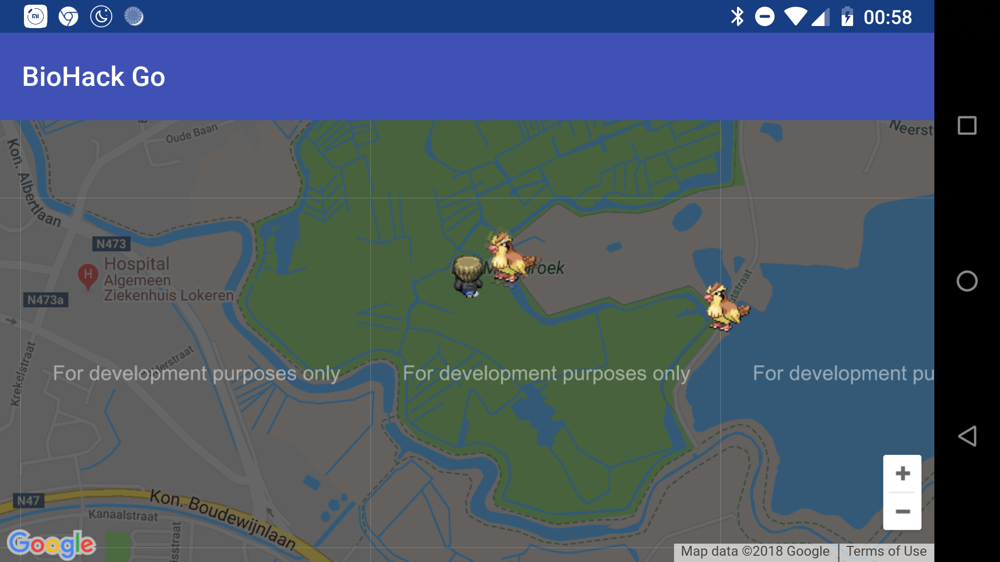
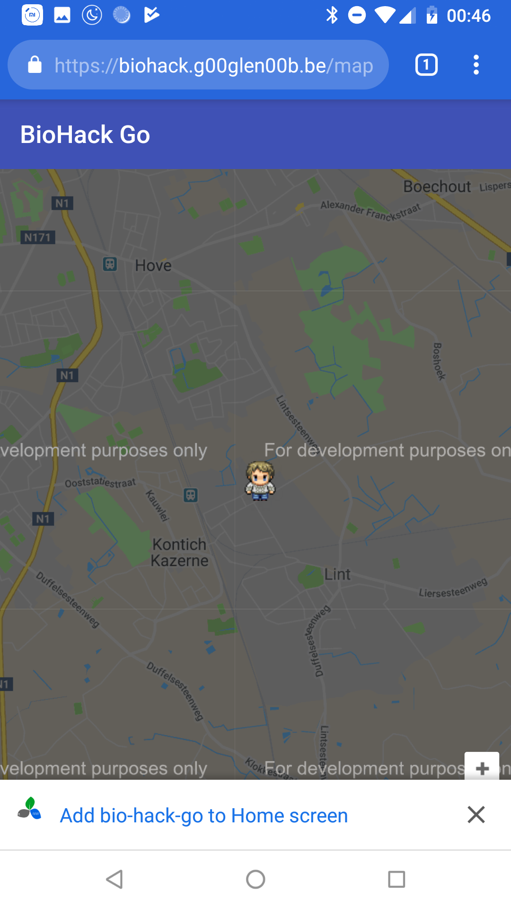
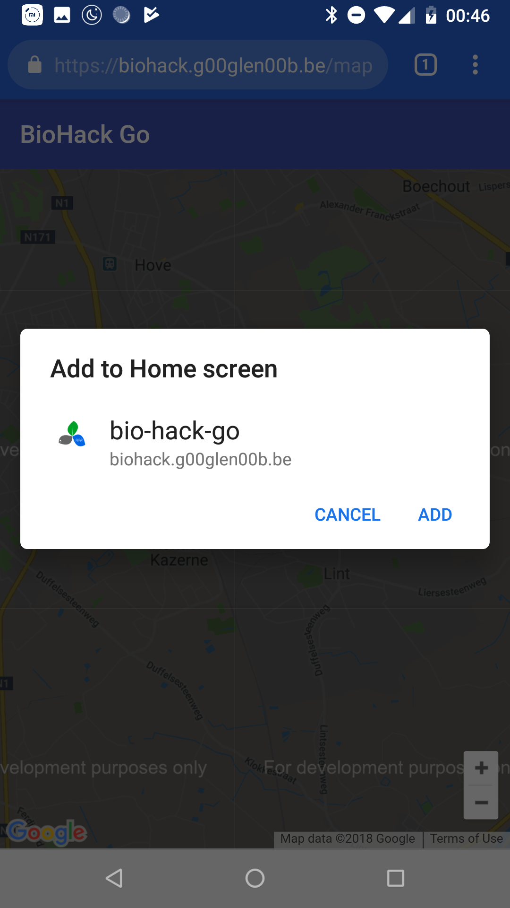
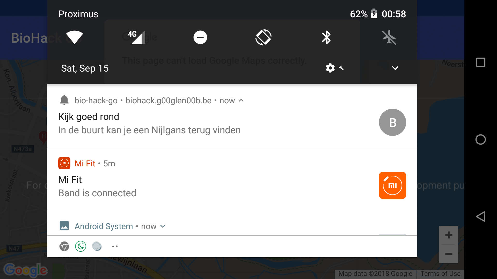

## Demo

This project is mostly there as a way to demonstrate the capabilities of working with **progressive webapps**. During the hackaton, two teams worked simultaneously on developing a progressive webapp and a native Android application, developing the same features.

### Geolocation

Geolocation is available through the [Geolocation API](https://developer.mozilla.org/en-US/docs/Web/API/Geolocation_API).  A demonstration about how to use the Geolocation API to track coördinates can be found within the [location.service.ts](https://github.com/aquafinnv/biodiversity-pwa/blob/d0426633e0d2e7df7d91971f811edbbbe8128770/src/app/map/location.service.ts#L12-L23).

### Offline availability

The service worker that is being registered automatically caches all files for offline availability. This service worker is automatically generated when using the **@angular/pwa** module.

An important notice though is that service workers are only picked up when the application is running over **HTTPS** and has been built using the production profile.

### App-like

Progressive webapps can be installed to your device, thanks to the [Web App Manifest](https://developer.mozilla.org/en-US/docs/Web/Manifest). This JSON file allows a user to configure the theme colors of the application, the name it should use and the icon that should be displayed.

When the application has a service worker registered, the web browser will automatically ask if the application should be added to your home screen. This means that this feature will also only work when the application is running over **HTTPS**.

Alternatively a user can manually add the application to their home screen, but then it won't be availabe within their application list, and it will have a small browser logo at the bottom right corner of the logo.

An example manifest can be found within [src/manifest.json](https://github.com/aquafinnv/biodiversity-pwa/blob/master/src/manifest.json).

### Push notifications

Just like native applications, progressive web apps can show notifications using the [Push API](https://developer.mozilla.org/en-US/docs/Web/API/Push_API). This feature requires a service worker to be registered as well, which means that the application should be served over **HTTPS**.

An example of how to create a push notification can be found within the [map-page.component.ts](https://github.com/aquafinnv/biodiversity-pwa/blob/d0426633e0d2e7df7d91971f811edbbbe8128770/src/app/map/map-page/map-page.component.ts#L55-L64).

## Conclusion

Progressive webapps can be an interesting alternative to developing native applications, certainly when you want to avoid users having to go to the app store and manually install the application. They certainly do not native applications in all cases though, since native apps can be more performant due to not running in a web shell. Additionally, browser support for these features (manifests, service workers, push API) is not available in all web browsers.